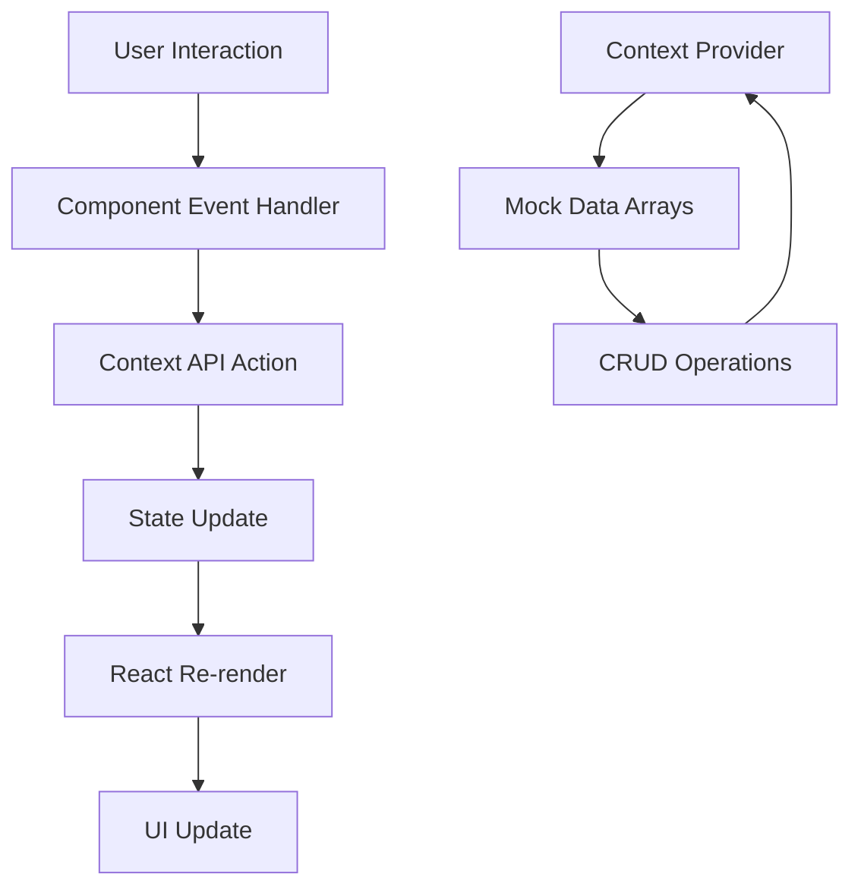

# Design Document: Construction Site Management System

## Overview

The Construction Site Management System (SiteOS Enterprise) is a production-quality React 19 frontend application that provides comprehensive construction project management capabilities. The system implements a dark industrial design aesthetic and serves four distinct user roles with role-based access control.

### System Architecture Philosophy

This is a frontend-only application that simulates a full-stack experience using React Context API as a mock data layer. The architecture prioritizes:

- **Component modularity**: Clear separation between layout, UI, and feature components
- **State centralization**: Single source of truth via Context API
- **Role-based security**: Navigation and route protection based on user roles
- **Responsive design**: Mobile-first approach with progressive enhancement
- **Type safety through structure**: Consistent data shapes and prop interfaces

### Key Technical Decisions

1. **React 19 with Vite**: Leverages latest React features (concurrent rendering, automatic batching) with fast HMR development experience
2. **Tailwind CSS utility-first**: Enables rapid UI development with consistent design tokens
3. **Context API over Redux**: Simpler state management appropriate for frontend-only scope
4. **Recharts for visualization**: Declarative chart library with good React integration
5. **React Router v6**: Modern routing with data loading and nested route support

## Architecture

### High-Level Component Hierarchy

```
App
├── AppContext.Provider (Global State)
├── Router
    ├── AppLayout
    │   ├── Sidebar (Navigation)
    │   ├── Navbar (Header)
    │   └── Outlet (Page Content)
    │       ├── Dashboard (Protected)
    │       ├── Projects (Protected: Admin, PM, SE)
    │       ├── Tasks (Protected: PM, SE)
    │       ├── Workforce (Protected: Admin, SE)
    │       ├── Inventory (Protected: Admin, PM, SK)
    │       └── Finance (Protected: Admin, PM)
    └── Login (Public)
```

### Data Flow Architecture



### Module Organization

```
src/
├── components/
│   ├── layout/          # AppLayout, Sidebar, Navbar
│   ├── ui/              # Button, Input, Card, Modal, Badge, Table
│   └── charts/          # BudgetChart, CostDistributionChart
├── pages/               # Dashboard, Projects, Tasks, Workforce, Inventory, Finance
├── context/             # AppContext.jsx (state + actions)
├── data/                # mockData.js (initial seed data)
├── utils/               # helpers.js (date formatting, calculations)
└── App.jsx              # Root component with Router
```

## Components and Interfaces

### Core Layout Components

#### AppLayout
**Purpose**: Provides consistent layout structure across all authenticated pages

**Props**: None (uses Outlet for nested routes)

**Structure**:
- Fixed sidebar (left, 256px width on desktop)
- Fixed navbar (top, full width)
- Main content area (scrollable, fills remaining space)
- Responsive: Sidebar collapses to hamburger menu below 768px

#### Sidebar
**Purpose**: Primary navigation with role-based menu items

**Props**:
```javascript
{
  currentUser: User,
  isCollapsed: boolean,
  onToggle: () => void
}
```

**Navigation Items**:
- Dashboard (all roles)
- Projects (Admin, Project_Manager, Site_Engineer)
- Tasks (Project_Manager, Site_Engineer)
- Workforce (Admin, Site_Engineer)
- Inventory (Admin, Project_Manager, Storekeeper)
- Finance (Admin, Project_Manager)

**Visual States**:
- Active route: bg-amber-500 with text-slate-950
- Inactive route: text-slate-400 with hover:bg-slate-800
- Icons from Lucide React

#### Navbar
**Purpose**: Top header with branding, date, notifications, and user menu

**Props**:
```javascript
{
  currentUser: User,
  onLogout: () => void,
  onSwitchRole: () => void
}
```

**Elements**:
- Title: "SiteOS Enterprise" (text-amber-500, font-bold)
- Current date (text-slate-400)
- Notification bell icon (with badge count)
- User avatar with dropdown (Profile, Switch Role, Logout)

### Reusable UI Components

#### Button
**Props**:
```javascript
{
  variant: 'primary' | 'secondary' | 'danger',
  size: 'sm' | 'md' | 'lg',
  onClick: () => void,
  disabled: boolean,
  children: ReactNode
}
```

**Variants**:
- Primary: bg-amber-500 hover:bg-amber-600
- Secondary: bg-slate-800 hover:bg-slate-700
- Danger: bg-rose-600 hover:bg-rose-700

#### Input
**Props**:
```javascript
{
  label: string,
  type: 'text' | 'number' | 'date' | 'email',
  value: string,
  onChange: (value: string) => void,
  error: string,
  required: boolean
}
```

**Styling**: bg-slate-900, border-slate-800, focus:border-amber-500

#### Select
**Props**:
```javascript
{
  label: string,
  options: Array<{value: string, label: string}>,
  value: string,
  onChange: (value: string) => void
}
```

#### Card
**Props**:
```javascript
{
  title: string,
  children: ReactNode,
  className: string
}
```

**Base Styling**: bg-slate-900, rounded-xl, p-6, border border-slate-800

#### Badge
**Props**:
```javascript
{
  variant: 'status' | 'success' | 'warning' | 'danger',
  children: string
}
```

**Variants**:
- Status: bg-blue-500/10 text-blue-500
- Success: bg-emerald-500/10 text-emerald-500
- Warning: bg-yellow-500/10 text-yellow-500
- Danger: bg-rose-500/10 text-rose-500

#### Modal
**Props**:
```javascript
{
  isOpen: boolean,
  onClose: () => void,
  title: string,
  children: ReactNode
}
```

**Features**:
- Overlay: bg-black/50 backdrop-blur-sm
- Content: bg-slate-900 rounded-xl max-w-2xl
- Close button: top-right corner
- ESC key to close
- Click outside to close

#### Table
**Props**:
```javascript
{
  columns: Array<{key: string, label: string, render?: (value, row) => ReactNode}>,
  data: Array<Object>,
  onRowClick: (row) => void
}
```

**Styling**:
- Header: bg-slate-800 text-slate-400
- Rows: hover:bg-slate-800/50
- Borders: border-slate-800
- Responsive: horizontal scroll on mobile

### Page Components

#### Dashboard
**Purpose**: Overview with KPIs, charts, and recent activity

**Layout**: Bento grid with varied card sizes

**Sections**:
1. KPI Cards (4 cards in grid)
   - Total Projects (count)
   - Active Workers (count)
   - Low Stock Items (count with warning)
   - Total Budget (sum with currency format)

2. Budget vs Actual Chart (BarChart)
   - X-axis: Project names
   - Y-axis: Amount
   - Two bars per project: Budget (amber), Actual (slate)

3. Recent Tasks List (Card with table)
   - Task name, Project name, Status badge
   - Limited to 5 most recent

#### Projects
**Purpose**: Project management with CRUD operations

**Features**:
- Search bar (filters by project name or location)
- Filter dropdown (by project type)
- "New Project" button (opens modal)
- Data table with columns: Name, Location, Type, Start Date, Budget, Status

**New Project Modal Form**:
- Project Name (text, required)
- Location (text, required)
- Project Type (select: Residential, Commercial, Infrastructure)
- Start Date (date, required)
- End Date (date, required)
- Budget (number, required)

#### Tasks
**Purpose**: Kanban board for task management

**Layout**: Three columns (Open, In Progress, Completed)

**Task Card**:
- Task name (text-slate-50)
- Project name (text-slate-400, text-sm)
- Assigned user (text-slate-400, text-sm)
- Draggable with visual feedback

**Drag & Drop**:
- Uses HTML5 drag and drop API
- onDragStart: store task id
- onDrop: call updateTaskStatus with new status
- Visual states: dragging (opacity-50), drop target (border-amber-500)

#### Workforce
**Purpose**: Worker management and attendance tracking

**Features**:
- Worker table with columns: Name, Skill, Contact, Rate Type, Base Rate, Attendance
- Attendance buttons per row: Present, Half Day, Absent
- Button states: active (bg-emerald-500), inactive (bg-slate-800)

**Attendance Logic**:
- Clicking button calls updateWorkerAttendance(workerId, status, date)
- Updates worker's attendance record in context
- Visual feedback: button color change

#### Inventory
**Purpose**: Material stock monitoring and reorder management

**Features**:
- Inventory table with columns: Item Name, Category, Unit Cost, Current Stock, Min Stock, Actions
- Low stock highlighting: row with bg-rose-500/10 when current < min
- Warning icon (AlertTriangle from Lucide) for low stock items
- "Reorder" button for low stock items

**Stock Status Logic**:
```javascript
const isLowStock = item.current_stock < item.min_stock_qty;
```

#### Finance
**Purpose**: Financial analytics and budget tracking

**Sections**:
1. Cost Distribution Pie Chart
   - Labor Costs (sum of Finance_Records where cost_category = 'Labor')
   - Material Costs (sum of Finance_Records where cost_category = 'Material')
   - Colors: amber-500 (Labor), slate-600 (Material)

2. Project Budget Table
   - Columns: Project, Budget, Total Cost, Remaining Budget
   - Total Cost: calculated by summing Finance_Records per project
   - Remaining Budget: Budget - Total Cost
   - Color coding: text-emerald-500 if remaining > 0, text-rose-500 if < 0

### Chart Components

#### BudgetChart
**Purpose**: Visualize budget vs actual expenses per project

**Implementation**:
```javascript
<ResponsiveContainer width="100%" height={300}>
  <BarChart data={projectData}>
    <CartesianGrid strokeDasharray="3 3" stroke="#1e293b" />
    <XAxis dataKey="name" stroke="#94a3b8" />
    <YAxis stroke="#94a3b8" />
    <Tooltip contentStyle={{backgroundColor: '#0f172a', border: '1px solid #334155'}} />
    <Legend />
    <Bar dataKey="budget" fill="#f59e0b" name="Budget" />
    <Bar dataKey="actual" fill="#475569" name="Actual" />
  </BarChart>
</ResponsiveContainer>
```

#### CostDistributionChart
**Purpose**: Show labor vs material cost distribution

**Implementation**:
```javascript
<ResponsiveContainer width="100%" height={300}>
  <PieChart>
    <Pie
      data={costData}
      cx="50%"
      cy="50%"
      labelLine={false}
      label={renderCustomLabel}
      outerRadius={80}
      fill="#8884d8"
      dataKey="value"
    >
      {costData.map((entry, index) => (
        <Cell key={`cell-${index}`} fill={COLORS[index]} />
      ))}
    </Pie>
    <Tooltip contentStyle={{backgroundColor: '#0f172a', border: '1px solid #334155'}} />
    <Legend />
  </PieChart>
</ResponsiveContainer>
```

## Data Models

### User
```javascript
{
  id: string,
  name: string,
  role: 'Admin' | 'Project_Manager' | 'Site_Engineer' | 'Storekeeper',
  email: string,
  phone: string
}
```

### Project
```javascript
{
  id: string,
  project_name: string,
  site_location: string,
  project_type: 'Residential' | 'Commercial' | 'Infrastructure',
  start_date: string, // ISO 8601 format
  end_date: string,   // ISO 8601 format
  budget: number,
  status: 'Planning' | 'Active' | 'Completed' | 'On Hold'
}
```

### Task
```javascript
{
  id: string,
  task_name: string,
  projectId: string,
  assigned_to: string, // userId
  status: 'Open' | 'In Progress' | 'Completed',
  priority: 'Low' | 'Medium' | 'High',
  due_date: string
}
```

### Worker
```javascript
{
  id: string,
  name: string,
  skill_type: 'Mason' | 'Carpenter' | 'Electrician' | 'Plumber' | 'Laborer',
  contact: string,
  rate_type: 'Daily' | 'Hourly',
  base_rate: number,
  attendance: Array<{date: string, status: 'Present' | 'Half Day' | 'Absent'}>
}
```

### Inventory_Item
```javascript
{
  id: string,
  item_name: string,
  category: 'Cement' | 'Steel' | 'Bricks' | 'Sand' | 'Tools' | 'Other',
  uom: string, // Unit of Measurement (kg, bags, pieces, etc.)
  unit_cost: number,
  min_stock_qty: number,
  current_stock: number,
  supplier: string
}
```

### Finance_Record
```javascript
{
  id: string,
  projectId: string,
  cost_category: 'Labor' | 'Material' | 'Equipment' | 'Other',
  amount: number,
  date: string, // ISO 8601 format
  description: string,
  payment_status: 'Pending' | 'Paid'
}
```

### Context State Shape
```javascript
{
  // Authentication
  currentUser: User | null,
  isAuthenticated: boolean,
  
  // Data Collections
  users: Array<User>,
  projects: Array<Project>,
  tasks: Array<Task>,
  workers: Array<Worker>,
  inventory: Array<Inventory_Item>,
  financeRecords: Array<Finance_Record>,
  
  // Actions
  login: (userId: string) => void,
  logout: () => void,
  switchRole: (newRole: string) => void,
  
  // Project Actions
  addProject: (project: Omit<Project, 'id'>) => void,
  updateProject: (id: string, updates: Partial<Project>) => void,
  deleteProject: (id: string) => void,
  
  // Task Actions
  addTask: (task: Omit<Task, 'id'>) => void,
  updateTaskStatus: (id: string, status: string) => void,
  
  // Worker Actions
  updateWorkerAttendance: (workerId: string, status: string, date: string) => void,
  
  // Inventory Actions
  issueMaterial: (itemId: string, quantity: number, projectId: string) => void,
  addProcurement: (itemId: string, quantity: number, cost: number) => void,
  
  // Finance Actions
  addFinanceRecord: (record: Omit<Finance_Record, 'id'>) => void
}
```

### Role-Based Access Matrix

| Page      | Admin | Project_Manager | Site_Engineer | Storekeeper |
|-----------|-------|-----------------|---------------|-------------|
| Dashboard | ✓     | ✓               | ✓             | ✓           |
| Projects  | ✓     | ✓               | ✓             | ✗           |
| Tasks     | ✗     | ✓               | ✓             | ✗           |
| Workforce | ✓     | ✗               | ✓             | ✗           |
| Inventory | ✓     | ✓               | ✗             | ✓           |
| Finance   | ✓     | ✓               | ✗             | ✗           |


## Correctness Properties

*A property is a characteristic or behavior that should hold true across all valid executions of a system—essentially, a formal statement about what the system should do. Properties serve as the bridge between human-readable specifications and machine-verifiable correctness guarantees.*

### Property 1: Context Data Structure Integrity

*For any* data entity (User, Project, Task, Worker, Inventory_Item, Finance_Record) stored in the Context Provider, the entity must contain all required fields with correct types as specified in the data model.

**Validates: Requirements 4.1, 4.2, 4.3, 4.4, 4.5, 4.6**

### Property 2: Role-Based Navigation Visibility

*For any* user role and navigation item, the navigation item should be visible if and only if the role has access according to the role-access matrix (Dashboard: all roles; Projects: Admin, Project_Manager, Site_Engineer; Tasks: Project_Manager, Site_Engineer; Workforce: Admin, Site_Engineer; Inventory: Admin, Project_Manager, Storekeeper; Finance: Admin, Project_Manager).

**Validates: Requirements 5.1, 5.2, 5.3, 5.4, 5.5, 5.6**

### Property 3: Unauthorized Route Redirection

*For any* user attempting to navigate to a route they don't have access to, the system should redirect them to the Dashboard page.

**Validates: Requirements 5.7**

### Property 4: Login State Update

*For any* valid userId, calling the login function should update the currentUser state to the user with that id and set isAuthenticated to true.

**Validates: Requirements 4.7**

### Property 5: Context CRUD Operations

*For any* valid data entity, calling the appropriate add/update function (addProject, addTask, updateTaskStatus, updateWorkerAttendance, issueMaterial, addProcurement) should correctly modify the corresponding array in the context state.

**Validates: Requirements 4.8**

### Property 6: Dashboard Accessibility

*For any* user role, the Dashboard page should be accessible and render without errors.

**Validates: Requirements 7.5**

### Property 7: Projects Table Completeness

*For any* project in the context state, that project should appear as a row in the Projects page table.

**Validates: Requirements 8.1**

### Property 8: Project Form Submission

*For any* valid project data submitted through the project creation form, the addProject function should be called and the new project should appear in the projects array.

**Validates: Requirements 8.8**

### Property 9: Task Card Display Completeness

*For any* task card rendered on the kanban board, the card must display the task name, project name, and assigned user name.

**Validates: Requirements 9.3**

### Property 10: Task Status Update on Drag

*For any* task moved to a different kanban column, the updateTaskStatus function should be called with the task id and the new status corresponding to the target column.

**Validates: Requirements 9.4**

### Property 11: Workers Table Completeness

*For any* worker in the context state, that worker should appear as a row in the Workforce page table.

**Validates: Requirements 10.1**

### Property 12: Worker Attendance Controls

*For any* worker row in the workforce table, the row must include three attendance control buttons: Present, Half Day, and Absent.

**Validates: Requirements 10.3**

### Property 13: Attendance Update on Button Click

*For any* worker and any attendance status button clicked, the updateWorkerAttendance function should be called with the worker id, the selected status, and the current date.

**Validates: Requirements 10.4**

### Property 14: Inventory Table Completeness

*For any* inventory item in the context state, that item should appear as a row in the Inventory page table.

**Validates: Requirements 11.1**

### Property 15: Low Stock Indicator Consistency

*For any* inventory item where current_stock < min_stock_qty, the item's row must display all three low stock indicators: row highlighting, warning icon, and reorder button.

**Validates: Requirements 11.3, 11.4, 11.5**

### Property 16: Finance Table Project Mapping

*For any* project in the context state, there should be exactly one row in the Finance page table corresponding to that project.

**Validates: Requirements 12.2**

### Property 17: Finance Calculations Accuracy

*For any* project, the Total Cost displayed should equal the sum of all finance records for that project, and the Remaining Budget should equal Budget minus Total Cost.

**Validates: Requirements 12.4, 12.5**

### Property 18: Chart Labeling Completeness

*For any* chart component (bar chart, pie chart), the chart must include axis labels (where applicable) and a legend.

**Validates: Requirements 16.6**

### Property 19: Active Route Highlighting

*For any* active route in the application, the corresponding navigation item in the Sidebar should be highlighted with the active state styling.

**Validates: Requirements 17.3**

### Property 20: Client-Side Navigation

*For any* navigation link clicked, the route should change without triggering a full page reload (client-side navigation).

**Validates: Requirements 17.4**

### Property 21: Navigation State Persistence

*For any* route transition, the application state (context data, user authentication) should be maintained without loss.

**Validates: Requirements 17.6**

### Property 22: Context State Change Re-rendering

*For any* state update in the Context Provider, all components that consume that specific state via useContext should re-render to reflect the updated data.

**Validates: Requirements 18.4**

### Property 23: Required Field Validation

*For any* required form field that is empty or invalid, the system should display an error message and prevent form submission.

**Validates: Requirements 19.2**

### Property 24: Successful Form Submission Behavior

*For any* valid form submission, the system should: (1) close the modal, (2) update the context state with the new data, (3) display the new record in the relevant table, and (4) clear all form fields.

**Validates: Requirements 19.3, 19.4, 19.5, 19.6**

### Property 25: Button Hover State

*For any* button component, hovering over it should trigger a color change to the hover state color.

**Validates: Requirements 20.1**

### Property 26: Button Click Visual Feedback

*For any* button component, clicking it should display a visual click effect.

**Validates: Requirements 20.2**

### Property 27: Task Card Drag Visual State

*For any* task card being dragged, the card should display a visual dragging state (e.g., reduced opacity).

**Validates: Requirements 20.3**

### Property 28: Immediate UI Update on Data Change

*For any* data update operation (add, update, delete), the UI should reflect the change immediately without requiring a manual refresh.

**Validates: Requirements 20.4**

## Error Handling

### Form Validation Errors

**Strategy**: Client-side validation with immediate feedback

**Implementation**:
- Required field validation: Check for empty strings or null values
- Type validation: Ensure numbers are numeric, dates are valid ISO 8601 format
- Range validation: Budget must be positive, dates must be logical (end_date > start_date)
- Display errors inline below the relevant input field
- Prevent form submission until all errors are resolved

**Error Messages**:
- "This field is required"
- "Please enter a valid number"
- "End date must be after start date"
- "Budget must be greater than zero"

### Context API Operation Errors

**Strategy**: Defensive programming with fallback states

**Implementation**:
- Check for entity existence before update/delete operations
- Validate foreign key relationships (e.g., projectId exists before adding task)
- Return success/failure status from context actions
- Log errors to console for debugging

**Error Scenarios**:
- Attempting to update non-existent entity: No-op, log warning
- Invalid foreign key reference: Reject operation, show error toast
- Duplicate ID: Generate new unique ID automatically

### Navigation Errors

**Strategy**: Graceful fallback to safe routes

**Implementation**:
- Protected routes check user role before rendering
- Unauthorized access redirects to Dashboard
- Invalid routes redirect to Dashboard (404 handling)
- Maintain navigation history for back button functionality

### Data Consistency Errors

**Strategy**: Validation at state update boundaries

**Implementation**:
- Validate data shape before adding to context arrays
- Ensure required fields are present
- Type coercion for numeric fields (string to number)
- Default values for optional fields

### UI Component Errors

**Strategy**: React Error Boundaries for graceful degradation

**Implementation**:
- Wrap major page components in Error Boundary
- Display user-friendly error message instead of blank screen
- Log error details to console
- Provide "Reload" button to recover

**Error Boundary Fallback UI**:
```
"Something went wrong loading this page. Please try reloading."
[Reload Button]
```

## Testing Strategy

### Dual Testing Approach

This system requires both unit testing and property-based testing for comprehensive coverage:

**Unit Tests**: Focus on specific examples, edge cases, and integration points
- Component rendering with specific props
- User interaction flows (click, drag, form submission)
- Edge cases (empty lists, low stock items, negative budgets)
- Integration between components and context

**Property Tests**: Verify universal properties across all inputs
- Data structure integrity across random data
- Role-based access control across all role combinations
- CRUD operations with randomly generated entities
- Calculation accuracy with varied numeric inputs

### Property-Based Testing Configuration

**Library Selection**: 
- **fast-check** for JavaScript/React property-based testing
- Integrates well with Jest/Vitest test runners
- Provides generators for common data types and custom generators

**Test Configuration**:
- Minimum 100 iterations per property test (due to randomization)
- Each property test must reference its design document property
- Tag format: `// Feature: construction-site-management-system, Property {number}: {property_text}`

**Example Property Test Structure**:
```javascript
import fc from 'fast-check';

// Feature: construction-site-management-system, Property 1: Context Data Structure Integrity
test('all users in context have required fields', () => {
  fc.assert(
    fc.property(
      fc.array(userGenerator()),
      (users) => {
        users.forEach(user => {
          expect(user).toHaveProperty('id');
          expect(user).toHaveProperty('name');
          expect(user).toHaveProperty('role');
          expect(user).toHaveProperty('email');
          expect(user).toHaveProperty('phone');
        });
      }
    ),
    { numRuns: 100 }
  );
});
```

### Unit Testing Strategy

**Component Testing**:
- Use React Testing Library for component tests
- Test user interactions with fireEvent or userEvent
- Assert on rendered output and DOM structure
- Mock Context Provider for isolated component tests

**Test Categories**:

1. **Layout Components** (Sidebar, Navbar, AppLayout)
   - Renders without crashing
   - Displays correct navigation items based on role
   - Responsive behavior at different viewport sizes
   - User menu interactions

2. **UI Components** (Button, Input, Card, Modal, Badge, Table)
   - Renders with different prop variants
   - Handles user interactions (click, change, submit)
   - Displays error states correctly
   - Applies correct styling classes

3. **Page Components** (Dashboard, Projects, Tasks, Workforce, Inventory, Finance)
   - Renders with mock context data
   - Displays correct data in tables/charts
   - Form submission updates context
   - Search and filter functionality
   - Role-based access enforcement

4. **Context Provider**
   - Initial state is correct
   - CRUD operations update state correctly
   - Login/logout updates authentication state
   - State changes trigger re-renders

**Example Unit Test**:
```javascript
import { render, screen, fireEvent } from '@testing-library/react';
import { AppContext } from '../context/AppContext';
import Projects from '../pages/Projects';

test('clicking New Project button opens modal', () => {
  const mockContext = {
    projects: [],
    addProject: jest.fn(),
    currentUser: { role: 'Admin' }
  };
  
  render(
    <AppContext.Provider value={mockContext}>
      <Projects />
    </AppContext.Provider>
  );
  
  const newProjectButton = screen.getByText('New Project');
  fireEvent.click(newProjectButton);
  
  expect(screen.getByText('Create New Project')).toBeInTheDocument();
});
```

### Integration Testing

**Focus Areas**:
- End-to-end user flows (login → navigate → create project → view in table)
- Context state updates propagating to multiple components
- Form submission → context update → table re-render
- Drag and drop → status update → UI refresh

**Tools**:
- React Testing Library for component integration
- Mock Service Worker (MSW) if adding API calls in future
- Testing Library User Event for realistic user interactions

### Test Coverage Goals

**Minimum Coverage Targets**:
- Statements: 80%
- Branches: 75%
- Functions: 80%
- Lines: 80%

**Priority Areas for 100% Coverage**:
- Context Provider CRUD operations
- Role-based access control logic
- Form validation logic
- Calculation functions (finance totals, remaining budget)

### Custom Generators for Property Tests

**Data Generators**:
```javascript
// User generator
const userGenerator = () => fc.record({
  id: fc.uuid(),
  name: fc.string({ minLength: 1, maxLength: 50 }),
  role: fc.constantFrom('Admin', 'Project_Manager', 'Site_Engineer', 'Storekeeper'),
  email: fc.emailAddress(),
  phone: fc.string({ minLength: 10, maxLength: 15 })
});

// Project generator
const projectGenerator = () => fc.record({
  id: fc.uuid(),
  project_name: fc.string({ minLength: 1, maxLength: 100 }),
  site_location: fc.string({ minLength: 1, maxLength: 100 }),
  project_type: fc.constantFrom('Residential', 'Commercial', 'Infrastructure'),
  start_date: fc.date().map(d => d.toISOString()),
  end_date: fc.date().map(d => d.toISOString()),
  budget: fc.integer({ min: 10000, max: 10000000 })
});

// Task generator
const taskGenerator = (projectIds, userIds) => fc.record({
  id: fc.uuid(),
  task_name: fc.string({ minLength: 1, maxLength: 100 }),
  projectId: fc.constantFrom(...projectIds),
  assigned_to: fc.constantFrom(...userIds),
  status: fc.constantFrom('Open', 'In Progress', 'Completed')
});
```

### Testing Best Practices

1. **Isolation**: Each test should be independent and not rely on other tests
2. **Clarity**: Test names should clearly describe what is being tested
3. **Arrange-Act-Assert**: Structure tests with clear setup, action, and verification
4. **Mock External Dependencies**: Mock Context Provider, Router, and external libraries
5. **Test User Behavior**: Focus on what users see and do, not implementation details
6. **Avoid Testing Implementation**: Don't test internal state or private methods
7. **Use Semantic Queries**: Prefer getByRole, getByLabelText over getByTestId
8. **Accessibility**: Ensure components are accessible (proper ARIA labels, keyboard navigation)

### Continuous Integration

**CI Pipeline**:
1. Lint code (ESLint)
2. Type check (if using TypeScript)
3. Run unit tests
4. Run property tests
5. Generate coverage report
6. Build production bundle
7. Run visual regression tests (optional)

**Quality Gates**:
- All tests must pass
- Coverage must meet minimum thresholds
- No linting errors
- Build must succeed

